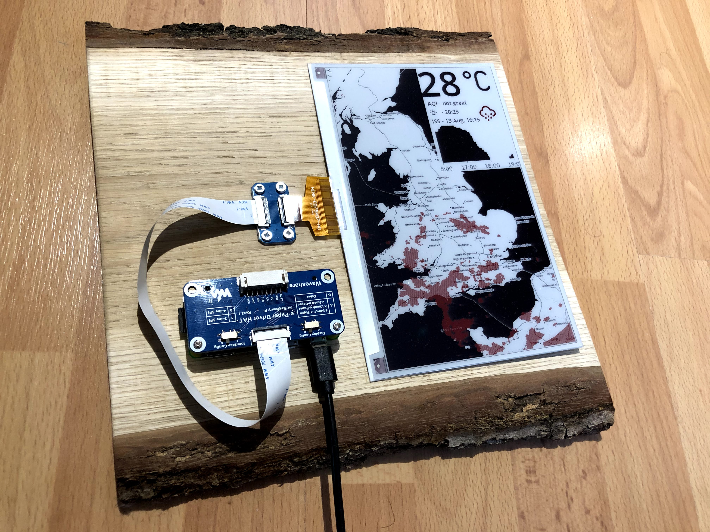
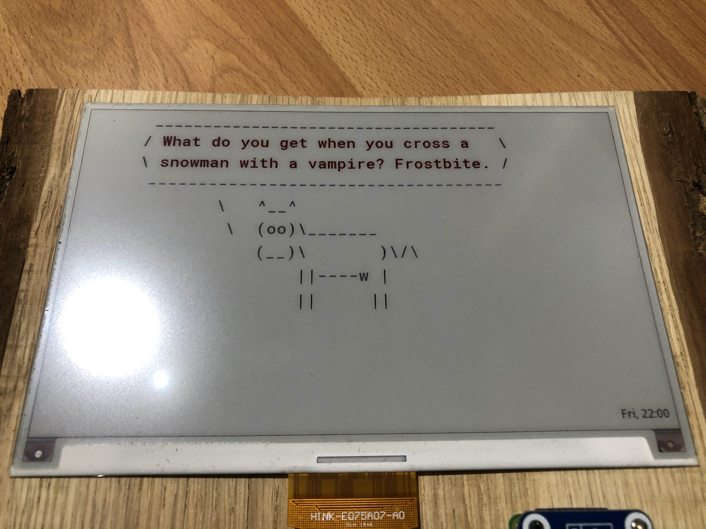

# eink-dashboard 📺

<https://jamesjarvis.io/projects/eink-dashboard/>

> A fun little rarely updating dashboard



Currently, this repo is just an assortment of random views I am creating for the display:

| view                                         | script                    |
| -------------------------------------------- | ------------------------- |
| Map with precipitation radar overlaid in red | [Mappyboi](./mappyboi.py) |
| Cowsay with Dad jokes                        | [Cowsay](./cowsay.py)     |



**Disclaimer**, this is not my best work - but it's been a bit of lockdown fun :D

## Installation

This requires python3 installed, as well as some other additional components.

Probs worth following this stuff <https://www.waveshare.com/wiki/7.5inch_e-Paper_HAT_(B)#Demo_code>

Then clone the repo onto the RPI, and create a new `settings.py` file from the [example provided](./settings.py.sample)

In order to run the scripts, just run

```bash
python3 mappyboi.py
```

Or whack it in a cron job to be run every 10 minutes with `crontab -e` and inputting the following:

```cron
*/10 * * * * python3 /home/pi/mappyboi.py
```
